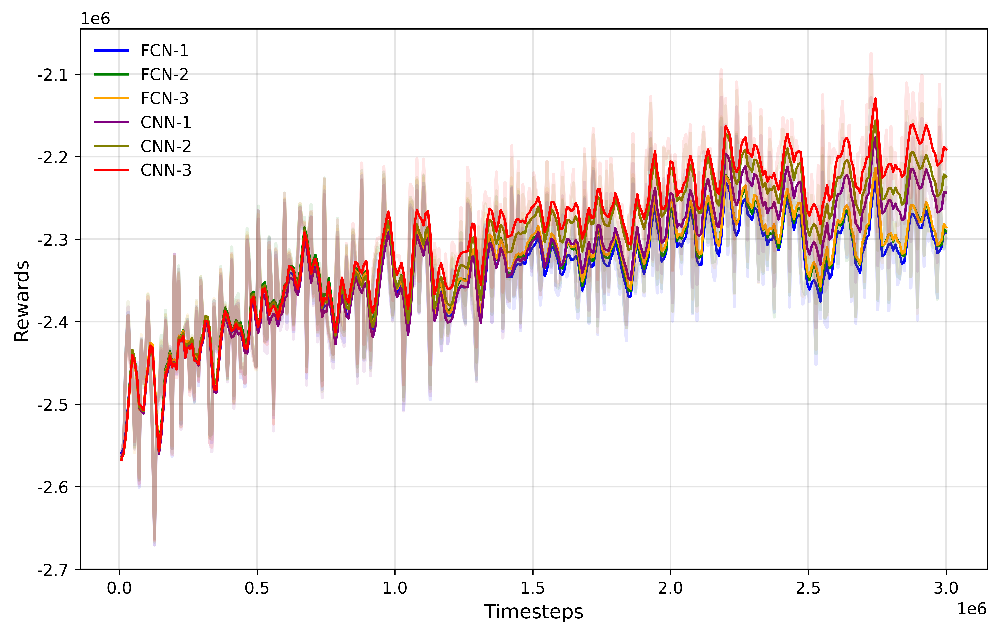
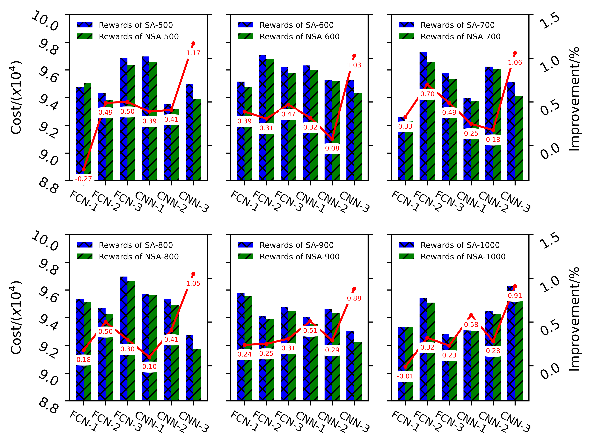
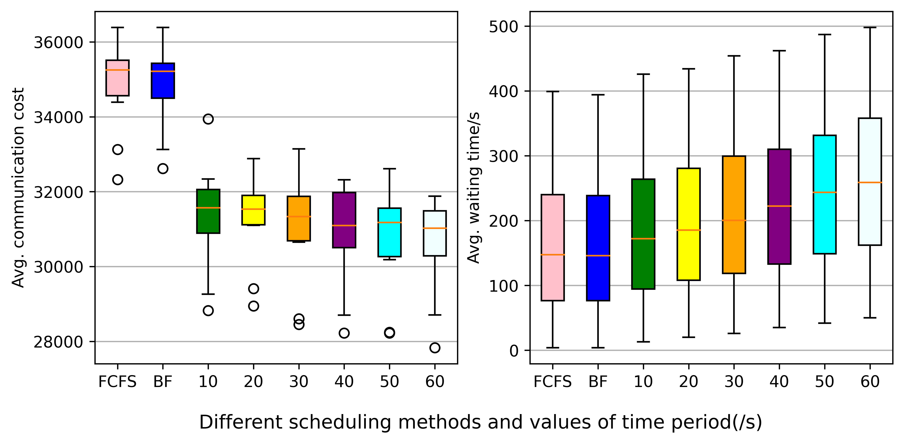

**This code is for the paper, "Optimization of Topology-Aware Job Allocation on a High-Performance Computing Cluster by Neural Simulated Annealing"(https://arxiv.org/abs/2302.03517), accepted by International Conference on Cluster Computing(2023).

# What it can do?
Jobs on high-performance computing (HPC) clusters can suffer significant performance degradation due to inter-job network interference. Topology-aware job allocation problem (TJAP) is such a problem that decides how to dedicate nodes to specific applications to mitigate inter-job network interference. In this paper, we study the window-based TJAP on a fat-tree network aiming at minimizing the cost of communication hop, a defined inter-job interference metric. The window-based approach for scheduling repeats periodically taking the jobs in the queue and solving an assignment problem that maps jobs to the available nodes. Two special allocation strategies are considered, i.e., static continuity assignment strategy (SCAS) and dynamic continuity assignment strategy (DCAS). For the SCAS, a 0-1 integer programming is developed. For the DCAS, an approach called neural simulated algorithm (NSA), which is an extension to simulated algorithm (SA) that learns a repair operator and employs them in a guided heuristic search, is proposed. The efficacy of NSA is demonstrated with a computational study against SA and SCIP. The results of numerical experiments indicate that both the model and algorithm proposed in this paper are effective.

# Getting Started
## Comparison for the NN architectures of RL

## Comparison of SA and NSA, SCIP and NSA

python result/NetandStep/boxline.png

## Comparison of different scheduling methods

